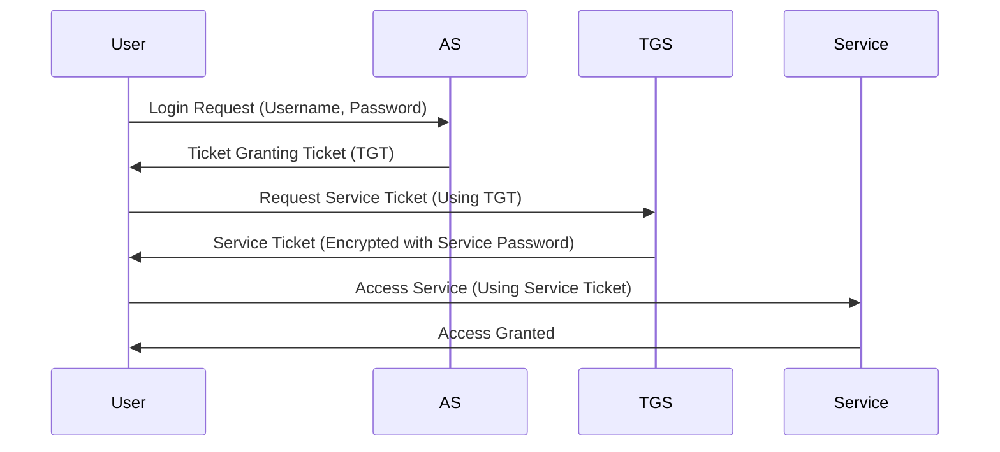
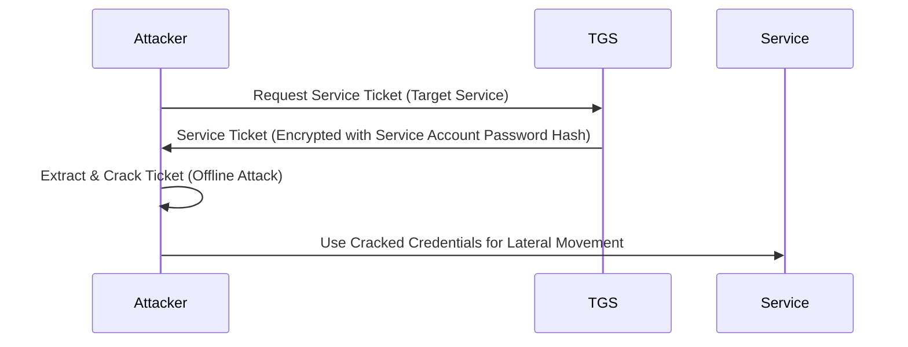

# Kerberos and Kerberoasting Explained

## What is Kerberos?
Kerberos is an authentication protocol used in Windows networks to verify user identities securely. Instead of requiring a password every time, Kerberos uses **tickets** to allow users to access services.

---

## How Kerberos Works

1. **User Login** – The user enters their username and password.
2. **Ticket Granting Ticket (TGT) Issued** – If credentials are correct, the Authentication Server (**AS**) provides a **TGT**.
3. **Request for a Service Ticket** – When the user wants to access a service, they use the **TGT** to request a **Service Ticket**.
4. **Service Ticket Issued** – The Ticket Granting Server (**TGS**) provides a **Service Ticket** encrypted with the service’s password.
5. **Accessing the Service** – The user presents the **Service Ticket** to the application or server, which verifies it and grants access.



---

## Types of Tickets in Kerberos

### Ticket Granting Ticket (TGT)
A master ticket issued when the user logs in, used to request access to other services.

### Service Ticket
A ticket issued when a user requests access to a specific service, encrypted with the service’s password.

---

## What is Kerberoasting?
Kerberoasting is an attack technique where an attacker extracts **Service Tickets** from Kerberos and attempts to crack them offline to retrieve service account passwords.

### How Kerberoasting Works:
1. The attacker requests a **Service Ticket** for a **targeted service**.
2. The **TGS** provides the **Service Ticket**, which is encrypted with the **service account’s password hash**.
3. The attacker extracts the **Service Ticket** and attempts to **crack** it offline using tools like **Hashcat** or **John the Ripper**.
4. If successful, the attacker obtains the **plaintext password** of the service account.



---

## Preventing Kerberoasting
- **Use Strong Service Account Passwords** (Long, complex, and rotated frequently)
- **Use Managed Service Accounts (MSAs) or Group Managed Service Accounts (gMSAs)**
- **Restrict Service Account Privileges** (Least privilege principle)
- **Monitor & Detect Unusual Kerberos Ticket Requests**
- **Enable AES Encryption for Kerberos** instead of weaker encryption like RC4

---

## Domain Controller and Workstation Log

### What is a Domain Controller?
A **Domain Controller (DC)** is a server in a Windows Active Directory network responsible for **authenticating and authorizing** users and computers. It handles:
- **User Authentication** – Validates login credentials.
- **Group Policies** – Enforces security policies across the domain.
- **Kerberos Ticket Distribution** – Issues TGTs and Service Tickets.
- **Centralized Management** – Controls user accounts and resources.

### What is a Workstation Log?
A **Workstation Log** contains records of user activities, logins, and system events on an individual computer (workstation). These logs help in:
- **Monitoring Login Activity** – Tracking user sessions.
- **Detecting Anomalies** – Identifying suspicious activities.
- **Incident Investigation** – Providing forensic data for security audits.
- **Troubleshooting** – Diagnosing authentication or system errors.

---

## CTF Investigation Plan
Since we have logs from both the **Domain Controller (DC)** and the **Workstation**, our goal is to analyze them and confirm if a **Kerberoasting attack** has occurred.

### Step 1: Extract the ZIP File
Since the **ZIP file** is password-protected, use the following command to extract it:

#### Linux & Windows:
```bash
7z x filename.zip -p"hacktheblue" -ooutput_folder
```

If the **password** is unknown, tools like **John the Ripper** or **7z2john** can be used to perform a brute-force attack to recover the password.

---

This guide provides a professional and structured overview of **Kerberos**, **Kerberoasting**, **Domain Controllers**, **Workstation Logs**, and an **investigation plan for CTF challenges**, helping you understand authentication and security risks in Windows networks.
